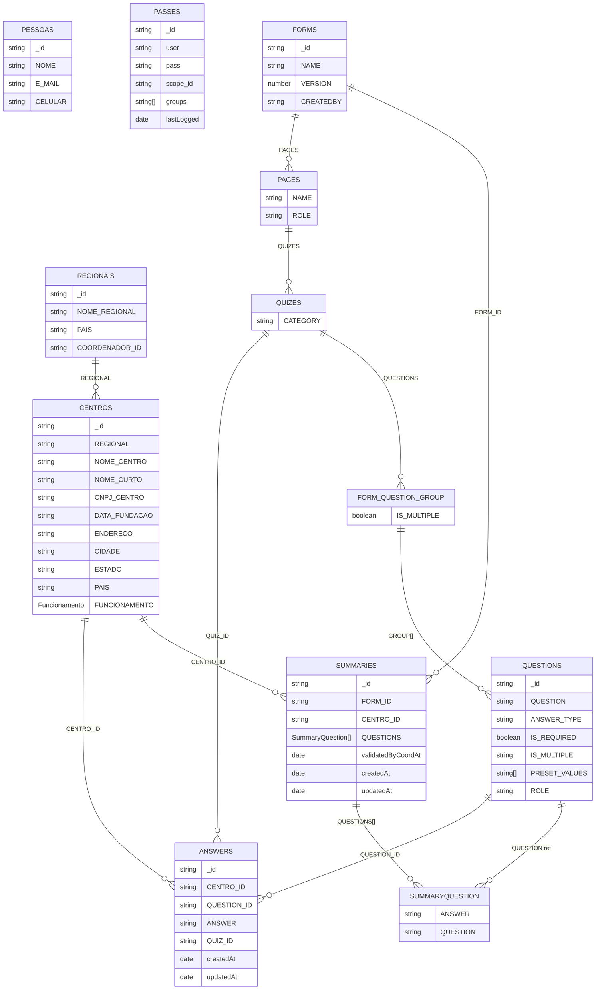

## Modelo atual (coleções como tabelas)

Diagrama geral das coleções/tabelas existentes e seus principais vínculos. Subdocumentos de `Forms` (pages/quizes) foram abertos como entidades auxiliares para facilitar a leitura.

### Observações rápidas
- `Forms` contém `PAGES` -> `QUIZES` -> `QUESTIONS` (grupo que referencia a coleção `Questions`).  
- `Answers` registra respostas individuais, ligadas a `QUESTION_ID`, `QUIZ_ID` e `CENTRO_ID`.  
- `Summaries` agrega respostas por formulário/centro e mantém perguntas respondidas (lista `QUESTIONS` com referência à pergunta original).
- `Regionais` e `Centros` formam a hierarquia geográfica usada por respostas e summaries.
- `Pessoas` e `Passes` representam usuários e credenciais (sem vínculo direto explícito nas coleções acima).

### Rascunho de plano para migração para NoSQL
- **Mapear padrões de acesso atuais**: leituras por formulário/ano/centro, histórico por pergunta, listagem de formulários ativos, login/escopos. Consolidar queries reais (API controllers/repos) para definir partições e índices.  
- **Escolher estratégia (single-table ou poucas tabelas)**: basear-se na proposta de `docs/dynamodb-model.md`; alinhar chaves de partição/sort para os padrões mapeados (ex.: `FORM#<id>#YEAR#<ano>` + `CENTRO#<id>` para respostas/summaries).  
- **Modelar itens-alvo**: definir como `Forms`, `Questions`, `Answers` (eventos) e `Summaries` serão serializados; incluir flags como `isLatest`, versionamento de formulário e trilhas de revisão.  
- **Planejar migração de dados**: script de export/import por coleção com transformação para o novo formato de item; validar consistência de referências (centro/question/quiz) antes de gravar.  
- **Evoluir serviços**: adaptar repositórios para escrever/leitor NoSQL atrás de uma interface comum; manter fallback de leitura no Mongo durante transição (feature flag).  
- **Cutover e limpeza**: rodar migração incremental, comparar contagens/hashes, ativar NoSQL em produção e retirar caches/coleções antigas quando estabilizar.
